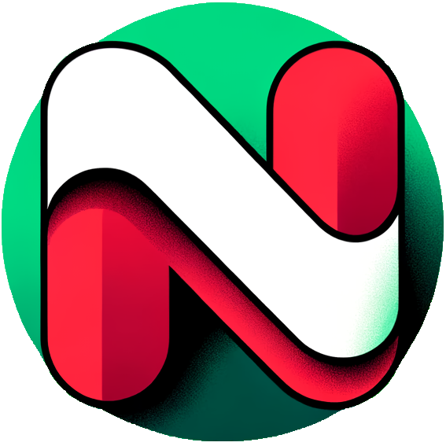
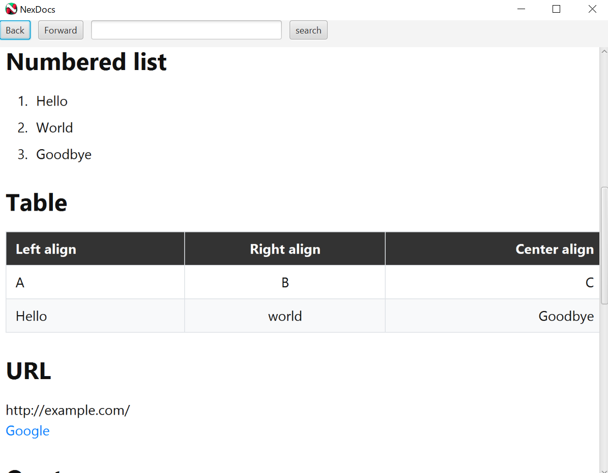
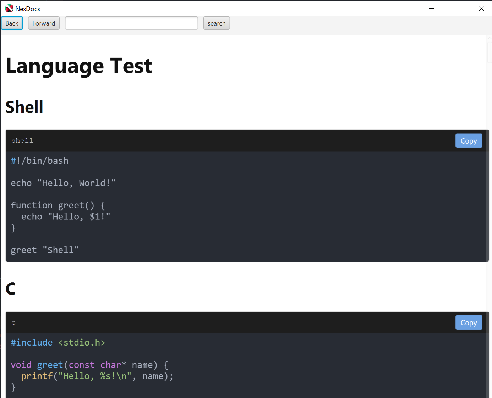
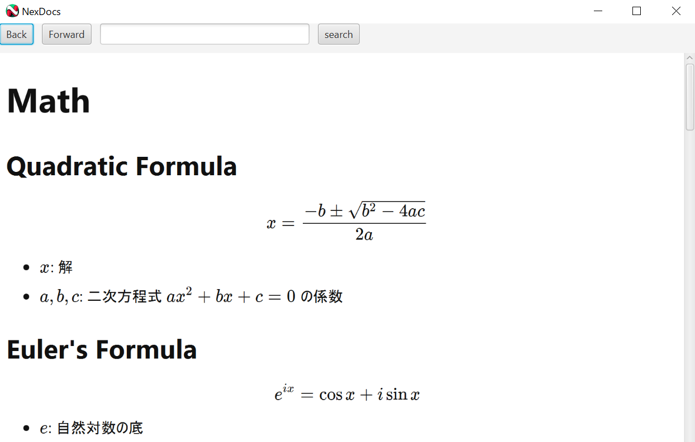

# NEXDOCS

## Overview

NEXDOCS is a versatile document conversion tool, enabling transformations between Markdown, HTML, and PDF formats. It incorporates a JavaFX GUI for an enhanced user experience and supports remote file handling through HTTP requests. Developed primarily in Scala, it also utilizes CSS and JavaScript for web-related styles and scripts.

## Features

### Document Conversion
- Convert Markdown to HTML with support for custom styles and scripts.
- Transform HTML back to Markdown.
- Convert HTML directly to PDF with options for styling.

### GUI Interface
- A JavaFX-based GUI provides functionalities for document conversion, preview, and interaction.
- Preview Markdown files converted to HTML in a custom UI.
- Support for TeX notation and code syntax highlighting.

### Remote File Handling and Conversion
- Fetch HTML content via HTTP requests.
- Convert fetched HTML content to PDF or Markdown and download it.
- Directly download the HTML content as HTML, plain text, PDF, or Markdown.

### Syntax Highlighting and Styling
- JavaScript and CSS integration for syntax highlighting in code blocks and comprehensive document styling.

## Screenshots

|                                  App View Basic                                  |                                 App View Language                                  |                                 App View Math                                  |
|:--------------------------------------------------------------------------------:|:----------------------------------------------------------------------------------:|:------------------------------------------------------------------------------:|
|  |  |  |

## Installation and Usage

### Prerequisites
- [Scala](https://www.scala-lang.org/)
- [Java Development Kit (JDK)](https://openjdk.java.net/)
- [sbt](https://www.scala-sbt.org/)

### Setup
Clone the repository and run the setup script:
~~~bash
git clone https://github.com/rxxuzi/NexDocs/
cd NexDocs
chmod +x SETUP.sh
./SETUP.sh
~~~
The [`SETUP.sh`](SETUP.sh) script will create necessary directories, check for prerequisites, and build the project.

### Running the Application
After setting up, you can run the application using sbt:
~~~bash
sbt run
~~~

## Sample Usage

### Convert Markdown to HTML and Save
~~~scala
package sample

import nex._

object Convert {
  def main(args: Array[String]): Unit = {
    val markdown = new NexMarkdown(Dox.readFileAsString("Sample.md"))
    val html = markdown.toHTML
    html.save("Sample.md")
  }
}
~~~

### Fetch Web Page and Convert to PDF
~~~scala
package sample

import global.{LogConfig, Operation}
import net.OpenHTML

object Fetch {
  def main(args: Array[String]): Unit = {
    Operation.rmdir("./output/")
    LogConfig.suppressFlyingSaucerLogs()
    val url = "https://api.jquery.com/"
    OpenHTML(url).html.removeJavaScript().toPdf.save("example")
  }
}
~~~

### Preview Markdown in GUI
~~~scala
package sample

import global.Operation
import nex.Dox
import ui.Gui

object Preview {
  def main(args: Array[String]): Unit = {
    Gui.run("./src/main/resources/markdown/Math.md")
  }
}
~~~

## File Structure

- `src/main/scala`: Main Scala source files.
- `src/main/resources/javascript`: JavaScript files for client-side functionality.
- `src/main/resources/stylesheet`: CSS files for styling.

## License

NEXDOCS is released under the MIT License. See [LICENSE](LICENSE) for more details.

## Author

The project is created and maintained by [rxxuzi](https://github.com/rxxuzi).

